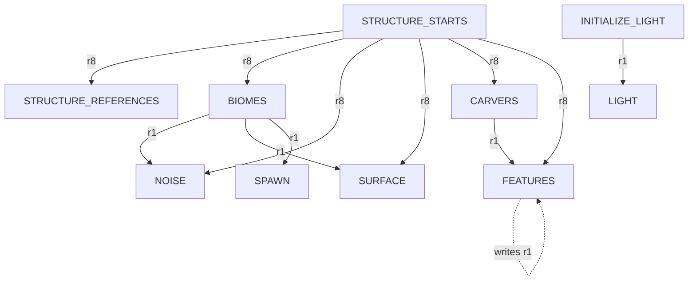

# Minecraft 1.21.11 Worldgen DAG — Overworld / Nether / End (dimension-aware) — Version-Bound Research

> **Status:** version-bound upstream research — do not edit to describe a different upstream version.
>
> **doc-type:** external-research (Documentation Policy §F) — source archaeology, not a Voxygen architecture description.
>
> **Research question (GitHub `rhythmatician/voxygen-monorepo#82`, part of #22):** source-grounded ordered DAG of Minecraft worldgen for **Overworld, Nether, and End**, from seed/configuration through climate/noise, biome placement, terrain shaping, aquifers, surface rules, carvers, and placed/configured features (ores, vegetation), recording per stage: I/O + dimensionality, ordering/dependencies, input-completeness + spatial halo, cost, determinism/entropy, and distant-visible impact across Voxy Levels L0–L4.
>
> **This is research, not the partition.** It records *what vanilla computes*; reuse/port/learn/omit decisions belong to `worldgen-partition` (#85, gated by #84). The L0–L4 columns are observations about vanilla output, not partition decisions.
>
> **Upstream project:** Minecraft (Mojang Studios).
>
> **Upstream version:** 1.21.11 (decompiled corpus self-identifies as `26.1-snapshot-11`).
>
> **Decompiler:** CFR 0.152 (`external/minecraft-src/cfr.jar`; `Decompiled with CFR 0.152` headers throughout the inspected corpus).
>
> **Artifact hash (reproduction anchor):** `26.1-snapshot-11.jar` / `client.jar` SHA-256 = `556C0FA70D367A2D0EC2DF5C9796C77EABE164BF08E0C581FC9CE17FA7436822` (both jars hash identically). No git SHA is established for this upstream; re-verification must compare against the Mojang 1.21.11 / `26.1-snapshot-11` artifacts. See §0.
>
> **Source corpus inspected:** `external/minecraft-src/src/net/minecraft/world/level/` (`chunk/status/*`, `levelgen/*`, `levelgen/synth/*`, `levelgen/carver/*`, `levelgen/blending/*`, `levelgen/placement/*`, `biome/*`), `net/minecraft/core/{QuartPos,SectionPos}`, `net/minecraft/world/level/dimension/DimensionType`, `data/worldgen/{NoiseData,TerrainProvider,SurfaceRuleData}`. Line numbers are against that CFR-decompiled tree.
>
> **Cross-reference:** [`docs/reference/upstream/minecraft-1.21.11-worldgen-seams.md`](../reference/upstream/minecraft-1.21.11-worldgen-seams.md) is the sibling *seams* reference (per-class internals: NoiseRouter, DensityFunction, NoiseChunk, RandomState, noise stack, Aquifer, Beardifier, Blender, SurfaceSystem, carvers). This document is the *DAG/ordering* view and does not restate class internals already grounded there.
>
> **Research completion date:** 2026-08-16.
>
> **Scope:** Describes **only** the named Minecraft upstream version. It does not describe current Voxygen implementation, architecture, or decisions. L0–L4 refers to Voxy LOD Levels (external, `voxy-0.2.11-alpha`) used purely as a distant-visibility yardstick.
>
> **Invalidation rule:** A newer Minecraft upstream requires re-verification against its own decompiled corpus. Do not silently edit this file to describe a different upstream — create a separately versioned artifact.

---

## 0. Reproduction & artifact hashes

The audit is reproducible from the decompiled corpus alone:

| Artifact | Location | Hash / version |
|---|---|---|
| Server/obf jar | `26.1-snapshot-11.jar` | SHA-256 `556C0FA70D367A2D0EC2DF5C9796C77EABE164BF08E0C581FC9CE17FA7436822` |
| Client jar | `client.jar` | SHA-256 `556C0FA70D367A2D0EC2DF5C9796C77EABE164BF08E0C581FC9CE17FA7436822` (identical) |
| Decompiler | `cfr.jar` | CFR 0.152; SHA-256 `F686E8F3DED377D7BC87D216A90E9E9512DF4156E75B06C655A16648AE8765B2` |
| Version manifest | `26.1-snapshot-11.json` | version id `26.1-snapshot-11`; SHA-256 `D3DE3C825F3AA4A283A2754559CDE6D76FC5AD92C0E914069EECFDB4001B5F57` |
| Decompiled tree | `src/` | derived from the jars above via CFR 0.152 |

Re-verify the anchor (PowerShell):

```powershell
Get-FileHash external/minecraft-src/26.1-snapshot-11.jar -Algorithm SHA256
Get-FileHash external/minecraft-src/cfr.jar -Algorithm SHA256
Get-FileHash external/minecraft-src/26.1-snapshot-11.json -Algorithm SHA256
```

`external/minecraft-src` is an expected **read-only** local reference target (`external/README.md`); it is not committed and must be provisioned before running the commands above. The hashes in this record were verified against the locally provisioned `reference-code/26.1-snapshot-11` artifact set on 2026-08-16. Every `external/minecraft-src/src/...:line` citation below is against the CFR-0.152 decompilation of the hashed jar, so line numbers are reproducible for anyone who regenerates the tree with the same decompiler. The two authoritative ordering sources are `ChunkStatus.java` (linear chain) and `ChunkPyramid.java` (`GENERATION_PYRAMID`, the side-input DAG with halos).

---

## 1. Two graphs, not one: ChunkStatus **linearity** vs the **side-input DAG**

Vanilla worldgen is often described as a linear pipeline. That is only half true. There are **two** distinct graphs, and the deliverable must keep them separate.

### 1.1 The linear chain — `ChunkStatus` promotion order

**Source:** `external/minecraft-src/src/net/minecraft/world/level/chunk/status/ChunkStatus.java:30-41`.

Each status carries `parent` + `index = parent.index + 1`; `isOrAfter/isBefore` compare `index`. A chunk is promoted status-by-status in this **total order**:

```
EMPTY(0) → STRUCTURE_STARTS(1) → STRUCTURE_REFERENCES(2) → BIOMES(3) → NOISE(4)
        → SURFACE(5) → CARVERS(6) → FEATURES(7) → INITIALIZE_LIGHT(8) → LIGHT(9)
        → SPAWN(10) → FULL(11)
```


Heightmap validity is a function of position on this chain (`ChunkStatus.java:28-29`, `Heightmap.java`):

* `WORLDGEN_HEIGHTMAPS = {OCEAN_FLOOR_WG, WORLD_SURFACE_WG}` — valid from `NOISE` onward.
* `FINAL_HEIGHTMAPS = {OCEAN_FLOOR, WORLD_SURFACE, MOTION_BLOCKING, MOTION_BLOCKING_NO_LEAVES}` — valid from `CARVERS` onward (after `SURFACE` top-blocks and carver removals mutate the column).

**Consequence for a silhouette/horizon consumer:** `NOISE` provides the first complete base-terrain height as `WORLD_SURFACE_WG` (not `WORLD_SURFACE`, which only exists at `CARVERS`). It is not the final visible geometry: `SURFACE` can add eroded-badlands and frozen-ocean extensions, `CARVERS` subtract, and structure/feature placement during `FEATURES` can add or replace blocks.

### 1.2 The side-input DAG — `ChunkPyramid.GENERATION_PYRAMID` halos

**Source:** `external/minecraft-src/src/net/minecraft/world/level/chunk/status/ChunkPyramid.java:18` (`GENERATION_PYRAMID`) + `ChunkStep.java:26` + `ChunkDependencies.java:16-50`.

Linearity says *what order a single chunk advances*. It does **not** say *which neighbor chunks must already be at some status* before a step can run. That is the real DAG: each `ChunkStep` declares `addRequirement(status, radius)` (neighbor chunks within `radius` must be at least `status`) and `blockStateWriteRadius(r)` (how far this step writes blocks outside its own chunk).

| Step | Direct requirements (`status` @ chunk radius) | `blockStateWriteRadius` |
|---|---|---|
| `EMPTY` | — | — |
| `STRUCTURE_STARTS` | — | — |
| `STRUCTURE_REFERENCES` | `STRUCTURE_STARTS` @ 8 | — |
| `BIOMES` | `STRUCTURE_STARTS` @ 8 | — |
| `NOISE` | `STRUCTURE_STARTS` @ 8, `BIOMES` @ 1 | 0 |
| `SURFACE` | `STRUCTURE_STARTS` @ 8, `BIOMES` @ 1 | 0 |
| `CARVERS` | `STRUCTURE_STARTS` @ 8 | 0 |
| `FEATURES` | `STRUCTURE_STARTS` @ 8, `CARVERS` @ 1 | 1 |
| `INITIALIZE_LIGHT` | — | — |
| `LIGHT` | `INITIALIZE_LIGHT` @ 1 | — |
| `SPAWN` | `BIOMES` @ 1 | — |
| `FULL` | — | — |



Key readings that the linear view hides:

* **`STRUCTURE_STARTS` @ radius 8** is required by *everything* through `FEATURES` — the 17×17 chunk halo (`8` each side) supplies structure starts/references for terrain adaptation (`Beardifier`) and later placement. This is the widest declared read halo in the graph.
* **`NOISE`/`SURFACE` need `BIOMES` @ radius 1**: aquifer sampling and (upgrade-world) blending reach one chunk out, and biome-dependent surface needs neighbor biomes at the chunk edge.
* **`FEATURES` need `CARVERS` @ radius 1 and *write* radius 1** — the classic "feature bleed": a tree/ore placed near a chunk edge writes blocks into the neighbor, so neighbors must be carved first. This write-radius is why features cannot be trivially parallelized per chunk.
* **`NOISE`..`CARVERS` all have `blockStateWriteRadius(0)`** — terrain/surface/carving only mutate the owning chunk; only `FEATURES` writes outward.

**Distinction stated plainly:** the *promotion order* (§1.1) is a total order per chunk; the *side-input DAG* (§1.2) is a partial order over (chunk, status) pairs with explicit spatial radii. A correct distant-terrain reconstruction depends on the DAG's read halos (especially `BIOMES` @ r1 for `NOISE`), not merely on the linear order.

---

## 2. Shared side inputs: seed / dimension / config → `RandomState`

Before any per-chunk stage runs, a per-(dimension, seed) `RandomState` is built **once** and shared by every chunk. These are the DAG's global side inputs.

**Source:** `RandomState.java:47` (`create`), `NoiseGeneratorSettings.java:35`, `NoiseRouter.java:17`, `Climate.java:44`.

| Side input | Type / dimensionality | Role |
|---|---|---|
| world seed | `long` | seeds `PositionalRandomFactory` (Xoroshiro or Legacy per settings) |
| dimension key | `ResourceKey<NoiseGeneratorSettings>` | selects the whole config bundle (lattice, router, surface rules, flags) |
| `NoiseGeneratorSettings` | record (registry data) | `noiseSettings`, `defaultBlock/Fluid`, `noiseRouter`, `surfaceRule`, `seaLevel`, `aquifersEnabled`, `oreVeinsEnabled`, `useLegacyRandomSource` |
| `NoiseRouter` | 15 `DensityFunction` fields | the only downstream terrain interface (§3) |
| `Climate.Sampler` | 6 `DensityFunction` (temp, veg, cont, erosion, depth, ridges) | biome placement input, quart-addressed |
| noise registry | `HolderGetter<NoiseParameters>` | concrete octave tables instantiated lazily by key |

`RandomState.create` (`RandomState.java:47`) forks positional randoms (`random`, `aquiferRandom=fromHash("aquifer")`, `oreRandom=fromHash("ore")`), builds the `SurfaceSystem`, and calls `router = settings.noiseRouter().mapAll(noiseWiringHelper)` **exactly once** — the `DensityFunction` tree is wired with concrete `NormalNoise`/`BlendedNoise` instances here, not per chunk. `useLegacyRandomSource` selects Legacy (Nether/End/Caves) vs Xoroshiro (Overworld) (`NoiseGeneratorSettings.java`, getRandomSource). This is a shared, cheap, fully deterministic side input; its entropy is entirely a function of (seed, dimension).

---

## 3. The per-stage master DAG (shared skeleton)

The following stages are shared across all three dimensions (which stages are *active* per dimension is in §5). "Halo" = spatial read radius the stage requires; "L0–L4" = whether the stage's contribution survives into distant-visible geometry at the coarsest Voxy Level(s). L0 voxel = 1 block; L4 voxel = 16 blocks (`voxy-0.2.11-alpha` §1).

**Generator method ordering:** structure starts/references are created first (`ChunkStatusTasks.java:49-67`), then `NoiseBasedChunkGenerator.createBiomes` (`:113`) → `fillFromNoise` (`:265`, terrain + aquifer substance + ore veins through the `NoiseChunk` block-state rule) → `buildSurface` (`:217/:226`) → `applyCarvers` (`:233`) → structure and placed-feature decoration interleaved by `GenerationStep` during `FEATURES` (`ChunkGenerator.java:257-324`). `getBaseColumn`/`iterateNoiseColumn` (`NoiseBasedChunkGenerator.java:149-213`) is the single-column base-terrain probe used by `getBaseHeight`.

| # | Stage (status) | Inputs | Outputs | Dimensionality | Depends on | Read halo | Cost | Determinism | Distant-visible L0–L4 |
|---|---|---|---|---|---|---|---|---|---|
| S0 | `RandomState` build (pre-chunk) | seed, dim key, `NoiseGeneratorSettings`, noise registry | wired `NoiseRouter`, `Climate.Sampler`, `SurfaceSystem` | global scalars → function graph | — | none | cheap, once | deterministic (seed,dim) | prerequisite for all Levels |
| S1 | Climate / base-noise fields | block/quart pos, wired router | 6 climate values + `preliminarySurfaceLevel` + `finalDensity` + aquifer/vein fields | climate 2D quart (`FlatCache(Cache2D)`); density 3D on cell lattice | S0 | own column; base3D on cell grid | climate cheap; `finalDensity` (BlendedNoise) dominates | deterministic | **L0–L4 (drives all silhouette)** |
| S2 | Biome placement (`BIOMES`) | `Climate.Sampler` 6-field target | `Holder<Biome>` per quart cell | 3D quart (x>>2,y>>2,z>>2) | S1 climate, `STRUCTURE_STARTS`@8 | quart within chunk; `NOISE` reads `BIOMES`@1 | cheap: nearest-point search over `ParameterList` (O(n) on quantized longs) | deterministic | indirect: selects surface, carver, structure, and feature sets; visible at any Level through those consumers |
| S3 | Terrain noise fill (`NOISE`) | wired `finalDensity`, `NoiseChunk` cell grid, biomes@1 | solid/air blocks + `WORLD_SURFACE_WG`/`OCEAN_FLOOR_WG` | 3D cell lattice → trilinear to block | S1, S2, `STRUCTURE_STARTS`@8 | `BIOMES`@1 (aquifer/blend edge) | **dominant compute**: cell grid + trilinear (128× fewer samples than blocks) | deterministic | **L0–L4 — this IS the distant terrain** |
| S4 | Aquifers (inside `NOISE` fill) | `barrier/fluidLevelFloodedness/fluidLevelSpread/lava` fields, `finalDensity` | fluid vs air substance at `finalDensity≤0` | 3D grid 10×9×10 @ 16×12×16 spacing + Voronoi | S3 (same fill loop) | ±1 chunk grid | high-frequency, moderate; disabled → `createDisabled` flat picker | deterministic | perched water/lava pockets: **L0–L2 only; invisible at L3–L4** |
| S5 | Surface (`SURFACE`) | `WORLD_SURFACE_WG`, biome@column, `SurfaceRules`, surface noises | near-surface material replacement plus eroded-badlands and frozen-ocean extensions | per-column 2D walk with vertical block edits | S3 height, S2 biome, `BIOMES`@1 | own column (+ biome edge) | moderate: per-column rule tree and extension noises | deterministic | ordinary skinning: L0–L2; badlands pillars/icebergs can alter **L3–L4 geometry** |
| S6 | Carvers (`CARVERS`) | `WorldCarver` per source-biome, `CarvingMask`, aquifer | air/cave carve-outs, `FINAL_HEIGHTMAPS` | 3D ellipsoids over 17×17 chunk ring | S3, `STRUCTURE_STARTS`@8 | **17×17 chunks (range 8)** | moderate; large neighborhood, per-chunk seeded random | deterministic per seed, but per-chunk `WorldgenRandom` stream | subtractive caves/canyons: **mostly L0–L1; rare canyon lips L2; invisible L3–L4** |
| S7a | Structure placement (`FEATURES`) | structure starts/references, structure registry, `GenerationStep`, terrain-adaptation side input | villages, monuments, fortresses, cities, and other structure blocks | multi-chunk 3D bounding boxes clipped to the writable chunk | starts/references, S6@1; **writes @1** | starts declared @8; writable region @1 | expensive and sparse; template/jigsaw placement | deterministic per seed, high spatial entropy | size-dependent; major structures affect **L0–L4** |
| S7b | Placed/configured features (`FEATURES`) | biome `PlacedFeature` lists, `GenerationStep`, per-chunk random | trees, ore deposits, lakes, springs, vegetation, top-layer edits | mixed 2D placement + 3D features | S6@1, `STRUCTURE_STARTS`@8; **writes @1** | reads `CARVERS`@1, writes neighbor@1 | expensive: many placements, per-feature random streams | deterministic per seed, **high local entropy**; write-radius 1 blocks per-chunk parallelism | ores are internal; trees and large configured features can affect L0–L2, exceptionally coarser Levels by footprint |

Notes tying rows to source:

* **S1/S3 threshold:** solid iff `finalDensity > SURFACE_DENSITY_THRESHOLD = 1.5625` (`NoiseRouterData.java`; seams §3). `WORLD_SURFACE_WG` is the highest opaque block from this fill.
* **Ore *veins* (S3, not S7):** `OreVeinifier` (`OreVeinifier.java:15`) is a `BlockStateFiller` consumed by the `NoiseChunk` block-state rule during `fillFromNoise`, gated by `veinToggle/veinRidged/veinGap` — it runs at `NOISE`, and only where `oreVeinsEnabled`. Ordinary ore *deposits* are configured features at `FEATURES` step `UNDERGROUND_ORES` (S7). These are two different mechanisms; both are horizon-invisible.
* **Aquifer (S4)** is not a separate status; it is decided inside the `NOISE` fill via `Aquifer.computeSubstance`. `createDisabled` (`Aquifer.java`) short-circuits to the flat `FluidPicker` when `aquifersEnabled==false` (Nether/End).
* **Carver ring (S6)** is verified from the generator loop: `int range = 8; for dx=-8..8 for dz=-8..8` over `region.getChunk(...)` (`NoiseBasedChunkGenerator.java:233`), each source chunk seeded by `random.setLargeFeatureSeed(seed+index, sourcePos.x, sourcePos.z)`.
* **Feature decoration order (S7):** 11 `GenerationStep.Decoration` steps `RAW_GENERATION, LAKES, LOCAL_MODIFICATIONS, UNDERGROUND_STRUCTURES, SURFACE_STRUCTURES, STRONGHOLDS, UNDERGROUND_ORES, UNDERGROUND_DECORATION, FLUID_SPRINGS, VEGETAL_DECORATION, TOP_LAYER_MODIFICATION` (`GenerationStep.java`), each a `PlacedFeature` list applied via `PlacedFeature.placeWithContext` with per-chunk `WorldgenRandom` unique seeds (`PlacedFeature.java`).
* **Structures share S7's loop:** for each decoration step, `ChunkGenerator.applyBiomeDecoration` places matching `StructureStart`s first, then that step's `PlacedFeature`s (`ChunkGenerator.java:275-324`). `STRUCTURE_STARTS` decides sparse multi-chunk layouts; `STRUCTURE_REFERENCES` makes starts discoverable from intersected chunks; actual blocks appear at `FEATURES`.

### 3.1 The 15-field router as the single terrain interface

**Source:** `NoiseRouter.java:17` + `NoiseRouterData.java`. Everything in S1/S3/S4 flows through these 15 `DensityFunction` fields, in codec/`RouterField` ordinal order 0..14:

```
barrier, fluidLevelFloodedness, fluidLevelSpread, lava,            // aquifer (S4)
temperature, vegetation, continents, erosion, depth, ridges,       // climate (S1→S2)
preliminarySurfaceLevel, finalDensity,                             // density (S1→S3)
veinToggle, veinRidged, veinGap                                    // ore veins (S3)
```

Downstream code (`NoiseChunk`, `SurfaceSystem`, `Aquifer`, `OreVeinifier`) reads only this record; `NoiseRouter.mapAll(Visitor)` rewrites the whole tree once. This record is the DAG's "waist": the only dependency terrain has on noise math.

---

## 4. Input-completeness & spatial-halo contract (per stage)

For a consumer that wants to reconstruct a stage's output without running the whole pipeline, the "input completeness" is: *what must already exist, and over what spatial extent.*

| Stage | Complete inputs required | Spatial halo (chunks) | Vertical extent | Notes |
|---|---|---|---|---|
| S0 | seed + dimension config + noise registry | n/a (global) | n/a | reusable across the whole dimension |
| S1 | S0 router | own column (climate flat-cached per column; base3D per cell) | full dim height | no chunk data needed — pure function of position |
| S2 (`BIOMES`) | S1 climate + `STRUCTURE_STARTS`@8 | quart cells of own chunk | full height (3D biomes) | quart addressing: 4×4×4-block cells |
| S3 (`NOISE`) | S1 `finalDensity` + S2 biomes@1 | **+1 chunk** (aquifer/blend edge) | cell lattice over full dim height | write radius 0 |
| S4 (aquifer) | S3 in progress + aquifer fields | +1 chunk grid | full height | inside S3 loop |
| S5 (`SURFACE`) | `WORLD_SURFACE_WG` + biome@column + S2@1 + surface noises | own column (+biome edge) | near-surface rule depth; extensions may rise above base height | write radius 0; badlands/iceberg extensions are geometry, not only veneer |
| S6 (`CARVERS`) | S3 blocks + `STRUCTURE_STARTS`@8 | **17×17 (range 8)** | carve Y-range per carver | write radius 0; reads huge neighborhood, writes local |
| S7 (`FEATURES`) | S6@1 + structure starts/references@8 + biome feature lists | reads +1 plus starts@8, **writes +1** | full structure/feature bounding volumes | structures and feature bleed prevent naive per-chunk parallelism |

**Takeaway:** base natural-terrain reconstruction needs S0→S3 with a **+1 chunk** biome halo plus the declared structure-start side input used by `Beardifier`. Complete visible geometry also needs S5 extensions and S7 structures/features; the range-8 and write-1 dependencies cannot be discarded when reproducing those outputs.

---

## 5. Per-dimension audits

Each dimension is a **different router + different lattice + different flags**, not the Overworld with parameters tweaked. Bootstrap presets: `NoiseGeneratorSettings.java` (bootstrap) + `NoiseSettings.java` + `NoiseRouterData.{overworld,nether,end}` + `SurfaceRuleData.{overworld,nether,end}`.

### 5.1 Lattice & flags (the dimension seam)

| Dimension | `NoiseSettings(minY,height,sizeH,sizeV)` | cellWidth × cellHeight | sections | default block / fluid | seaLevel | aquifers | oreVeins | randomSource | surface rules |
|---|---|---|---|---|---|---|---|---|---|
| Overworld | `(-64, 384, 1, 2)` | **4 × 8** | 24 | STONE / WATER | 63 | **true** | **true** | Xoroshiro | `overworld()` |
| Nether | `(0, 128, 1, 2)` | **4 × 8** | 8 | NETHERRACK / LAVA | 32 | false | false | Legacy | `nether()` |
| End | `(0, 128, 2, 1)` | **8 × 4** (swapped) | 8 | END_STONE / **AIR** | 0 | false | false | Legacy | `end()` |

`cellWidth = QuartPos.toBlock(sizeH)`, `cellHeight = QuartPos.toBlock(sizeV)` (`NoiseSettings.java`). The End's lattice is **swapped** (coarser XZ, finer Y) — any tiling that hardcodes 4×8 is wrong for the End. Invariants (`NoiseSettings.create`, `DimensionType`): `minY%16==0`, `height%16==0`, `minY+height ≤ MAX_Y+1`.

### 5.2 Overworld

* **Full pipeline S0–S7 active.** Only dimension with **aquifers (S4)** and **ore veins (S3 OreVeinifier)** enabled.
* **Terrain shape:** `SLOPED_CHEESE = noiseGradientDensity(factor, depth + jaggedness·halfNegative(jagged)) + BASE_3D_NOISE_OVERWORLD` where `BASE_3D_NOISE_OVERWORLD = BlendedNoise.createUnseeded(0.25, 0.125, 80, 160, 8)` (`NoiseRouterData.java`). Continents/erosion/ridges are `flatCache(cache2d(shiftedNoise2d(...)))` 2D climate → `TerrainProvider` cubic splines → offset/factor/jaggedness.
* **Biomes:** `MultiNoiseBiomeSource` over full 6-D climate; 3D biomes (depth axis 3D).
* **Surface:** `SurfaceRuleData.overworld()` selects biome material rules and `SurfaceSystem` separately adds eroded-badlands pillars and frozen-ocean icebergs (`SurfaceSystem.java:114-154,189-251`). Those extensions can change coarse visible geometry.
* **Blending (S3 side):** only non-`EMPTY` for old-world upgrades (`Blender.of` returns `EMPTY` for new worlds); `HEIGHT_BLENDING_RANGE ≈ 7 sections`, `DENSITY_BLENDING_RANGE ≈ 2 cells` — this is the origin of the `BIOMES`@1 / `NOISE`@1 halo.
* **Distant-visible:** S1/S3 dominate natural terrain at L0–L4; surface extensions and major structures are sparse but can also survive at L3–L4.

### 5.3 Nether

* **S4 aquifers OFF, ore veins OFF, Legacy random.** `Aquifer.createDisabled` with the fluid picker; fluid is LAVA at seaLevel 32.
* **Terrain shape:** `BASE_3D_NOISE_NETHER = BlendedNoise.createUnseeded(0.25, 0.375, 80, 60, 8)` — different `yScale`/`yFactor` than Overworld, producing the characteristic vertical closed ceiling+floor (the `finalDensity` field is clamped so both the floor and the y≈128 roof are solid). Same 4×8 lattice as Overworld but only 8 sections (0..128).
* **Biomes:** `TEMPERATURE_NETHER`/`VEGETATION_NETHER` use `NormalNoise.createLegacyNetherBiome` (legacy init in the wiring `Visitor`, `RandomState.java`), i.e. a **different noise instantiation** than Overworld climate — a genuine dimension-specific seam, not a parameter.
* **Surface:** `SurfaceRuleData.nether()` — netherrack/soul sand/soul soil/basalt/blackstone bands; `ON_CEILING/UNDER_CEILING` conditions matter here (Overworld mostly uses `ON_FLOOR`).
* **Distant-visible:** the closed ceiling means the L4 silhouette is a slab, not an open horizon; still driven entirely by S1/S3.

### 5.4 End

* **S4 aquifers OFF, ore veins OFF, Legacy random, fluid = AIR, seaLevel 0.** No fluid model at all.
* **Different terrain primitive:** `slopedCheeseEnd = EndIslandDensityFunction(seed) + BASE_3D_NOISE_END` where `BASE_3D_NOISE_END = BlendedNoise.createUnseeded(0.25, 0.25, 80, 160, 4)` (note `smear=4`, not 8). `EndIslandDensityFunction` uses **`SimplexNoise`** (2D/3D simplex, `SimplexNoise.java`), instantiated with the raw seed in the wiring `Visitor` — the only dimension whose base density is not the Overworld/Nether `ImprovedNoise`-Perlin `BlendedNoise` alone. Central island + radial outer islands are a distance function around origin (`ISLAND_CHUNK_DISTANCE`), not climate splines.
* **Lattice swapped:** `(0,128,2,1)` → **8×4** cells (2×32×2 cells per chunk), coarser XZ, finer Y.
* **Biomes:** End biome source is effectively a fixed small set keyed off the same climate machinery but the End preset; `depth`/`ridges` play a reduced role vs Overworld continents.
* **Surface:** `SurfaceRuleData.end()` — essentially end-stone everywhere (trivial veneer).
* **Distant-visible:** floating-island archipelago — S1/S3 (simplex island field) fully define the silhouette; there is nothing subtractive (no aquifers) except carvers, which the End effectively does not use for horizon-scale geometry.

### 5.5 Shared vs dimension-specific seams

| Seam | Shared across dims | Dimension-specific |
|---|---|---|
| `ChunkStatus` chain & `GENERATION_PYRAMID` halos | ✅ identical (§1) | — |
| `RandomState`/`NoiseRouter.mapAll` wiring mechanism | ✅ same code path | seed-fork + Legacy-vs-Xoroshiro choice differs |
| 15-field router **interface** | ✅ same record | **field *contents* differ per dim** (routers `overworld/nether/end`) |
| Cell lattice math (`QuartPos.toBlock`) | ✅ same formula | **values differ: 4×8 (OW/Nether) vs 8×4 (End)** |
| Climate 6-D → biome nearest-point search | ✅ same algorithm | Nether uses legacy nether-biome noise; End uses End preset |
| Base 3D density primitive | mechanism shared | **OW/Nether = BlendedNoise; End = EndIsland(SimplexNoise)+BlendedNoise** |
| Aquifers (S4) | mechanism shared | **only Overworld active** |
| Ore veins (S3 OreVeinifier) | mechanism shared | **only Overworld active** |
| Surface rule engine | ✅ same `SurfaceRules` | rule trees differ (`overworld/nether/end`) |
| Carver 17×17 ring | ✅ same loop | carver *sets* differ per biome; End ~none for horizon |
| Feature `GenerationStep` order | ✅ same 11 steps | feature *contents* differ per biome/dim |

**Do not generalize the Overworld heightmap abstraction to Nether (closed ceiling, no aquifers) or End (swapped lattice, simplex island field, AIR fluid).** These are separate audits with a shared *interface* (the 15-field router + ChunkStatus DAG) but dimension-specific *content and lattice*.

---

## 6. Distant-visible (L0–L4) impact synthesis

Voxy Levels: voxel edge = `1<<lvl` blocks → L0=1, L1=2, L2=4, L3=8, L4=16; `WorldSection` footprint = `32<<lvl` blocks (`voxy-0.2.11-alpha` §1). A stage "affects Level Ln" if its geometric contribution is larger than one Ln voxel *and* is opaque/height-setting.

| Stage | L0 (1 blk) | L1 (2) | L2 (4) | L3 (8) | L4 (16) |
|---|---|---|---|---|---|
| S1 climate/base-noise (drives height) | ✅ | ✅ | ✅ | ✅ | ✅ |
| S3 terrain fill (`finalDensity`) | ✅ | ✅ | ✅ | ✅ | ✅ |
| S2 biome (material/tint, not height) | ✅ | ✅ | ~ | ✗ | ✗ |
| S5 surface rules/extensions | ✅ | ✅ | ✅ | ~ | ~ |
| S4 aquifer fluid pockets | ✅ | ✅ | ✗ | ✗ | ✗ |
| S6 carvers (caves/canyons, subtractive) | ✅ | ✅ | ~ (canyon lips) | ✗ | ✗ |
| S7a structures | ✅ | ✅ | ✅ | ✅ | ✅ (major structures) |
| S7b features/ores/vegetation | ✅ | ✅ | ~ (large features) | rare | rare |

✅ = materially affects that Level; ~ = marginal; ✗ = normally averaged out by downsampling. **S0→S3 determines the base natural-terrain silhouette**, with dimension-specific router/lattice. It is not the whole L3–L4 scene: Overworld surface extensions and major structures can survive coarse aggregation. This is an observation about vanilla output for the partition ticket to act on, not itself a partition decision.

---

## 7. Determinism & entropy summary

| Stage | Determinism | Entropy source | Reproducible from |
|---|---|---|---|
| S0 RandomState | fully deterministic | seed + dimension | (seed, dim) |
| S1 climate/base-noise | fully deterministic | wired `NormalNoise`/`BlendedNoise` | (seed, dim, pos) |
| S2 biomes | fully deterministic | climate target → nearest `ParameterPoint` | (seed, dim, quart pos) |
| S3 terrain fill | fully deterministic | `finalDensity` | (seed, dim, pos) |
| S4 aquifers | deterministic | `aquiferRandom=fromHash("aquifer")` + fields | (seed, dim, cell) |
| S5 surface | deterministic | surface/extension noises + `noiseRandom.at(x,0,z)` | (seed, dim, biome, column) |
| S6 carvers | deterministic **per seed**, high local variety | per-source-chunk `WorldgenRandom.setLargeFeatureSeed(seed+idx, cx, cz)` | (seed, dim, source chunk) |
| S7a structures | deterministic **per seed**, sparse/high variety | structure-set placement + per-step feature seed | (seed, dim, structure registry, starts/references, chunk, step) |
| S7b features | deterministic **per seed**, **highest local entropy** | per-chunk per-step `WorldgenRandom` unique seeds; write-radius 1 | (seed, dim, biome feature lists, chunk, step) |

Nothing in vanilla worldgen is non-deterministic given (seed, dimension, position); "high entropy" here means *high spatial-frequency variety and per-chunk independent random streams*, which is what makes S6/S7 expensive and hard to parallelize (write bleed), not non-reproducible.

---

## 8. Evidence index (primary sources)

All paths are `external/minecraft-src/src/net/minecraft/...` unless noted; line numbers are against the CFR-0.152 tree of the hashed jar (§0).

| Topic | Source |
|---|---|
| ChunkStatus chain, heightmap validity | `world/level/chunk/status/ChunkStatus.java:28-41`; `world/level/levelgen/Heightmap.java` |
| Side-input DAG (halos, write radii) | `world/level/chunk/status/ChunkPyramid.java:18`; `ChunkStep.java:26`; `ChunkDependencies.java:16-50` |
| Generator stage ordering | `world/level/levelgen/NoiseBasedChunkGenerator.java:113,149,217,226,233,265` |
| Carver 17×17 ring (range 8) | `world/level/levelgen/NoiseBasedChunkGenerator.java:233` (`applyCarvers`); `world/level/levelgen/carver/WorldCarver.java` |
| 15-field router | `world/level/levelgen/NoiseRouter.java:17`; `NoiseRouterData.java` |
| DensityFunction algebra / constants | `world/level/levelgen/DensityFunction.java`; `DensityFunctions.java`; `NoiseRouterData.java` |
| NoiseChunk cell grid / interpolation | `world/level/levelgen/NoiseChunk.java` |
| Per-dimension settings & lattice | `world/level/levelgen/NoiseSettings.java`; `NoiseGeneratorSettings.java` (bootstrap) |
| RandomState wiring (Legacy vs Xoroshiro, once) | `world/level/levelgen/RandomState.java:47`; `PositionalRandomFactory.java` |
| Noise stack | `world/level/levelgen/synth/{NormalNoise,PerlinNoise,ImprovedNoise,SimplexNoise,BlendedNoise}.java` |
| Terrain splines | `data/worldgen/TerrainProvider.java`; `world/level/levelgen/DensityFunctions.java` (spline); `util/CubicSpline.java` |
| Climate / biome source | `world/level/biome/Climate.java:44`; `MultiNoiseBiomeSource.java` |
| Aquifer grid & disabled path | `world/level/levelgen/Aquifer.java` |
| OreVeinifier (S3, block-state filler) | `world/level/levelgen/OreVeinifier.java:15` |
| Surface system & rules | `world/level/levelgen/SurfaceSystem.java`; `SurfaceRules.java`; `data/worldgen/SurfaceRuleData.java` |
| Beardifier / Blender (structure/upgrade density) | `world/level/levelgen/Beardifier.java`; `blending/Blender.java`; `blending/BlendingData.java` |
| Structure planning/references/placement | `world/level/chunk/ChunkGenerator.java:257-324,380-461`; `world/level/chunk/status/ChunkStatusTasks.java:49-67`; `world/level/levelgen/structure/StructureStart.java` |
| Feature decoration | `world/level/chunk/ChunkGenerator.java:257-324`; `world/level/levelgen/GenerationStep.java`; `levelgen/placement/PlacedFeature.java` |
| Coordinates / lattices | `core/QuartPos.java`; `core/SectionPos.java`; `world/level/dimension/DimensionType.java` |

Sibling reference (class internals, same upstream/hash): [`docs/reference/upstream/minecraft-1.21.11-worldgen-seams.md`](../reference/upstream/minecraft-1.21.11-worldgen-seams.md). Voxy Level semantics: [`docs/reference/upstream/voxy-0.2.11-alpha-storage-and-lod-seams.md`](../reference/upstream/voxy-0.2.11-alpha-storage-and-lod-seams.md).

---
*Version-pinned DAG record for Minecraft 1.21.11 (`26.1-snapshot-11`, jar SHA-256 `556C0FA7…436822`) worldgen, Overworld/Nether/End, as inspected 2026-08-16. Research only — not partition decisions. Newer Minecraft versions require a separately versioned document.*
